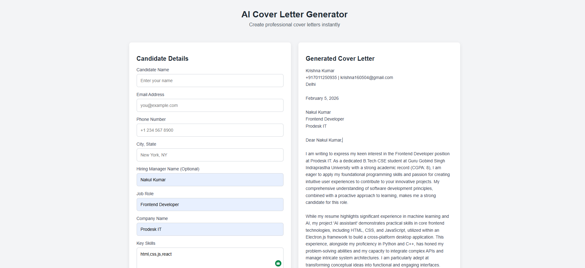

# 📄 AI Cover Letter Generator

## 📸 Project Preview

### Input Form


### Result & Resume Upload


---

An **AI-Powered Cover Letter Generator** built to help job seekers create professional, personalized cover letters in seconds.
This project focuses on **real-world full-stack development**, including **AI integration**, **file handling**, and **secure API usage**.

---

## 🚀 Features

### ✅ Level 1 – Core Functionality
- Clean, professional form interface
- Collects essential user details (Name, Job Title, Company, etc.)
- Real-time validation for required fields
- Generates a structured cover letter

### ✅ Level 2 – AI Integration
- Powered by **Google Gemini API**
- Dynamic prompt engineering for professional tone
- Secure API key management via `.env`
- Handles loading states and API errors gracefully

### ✅ Level 3 – Resume Support & Personalization
- **PDF Resume Parsing**: Extracts text from uploaded resumes
- **Context-Aware Generation**: AI uses resume details to personalize the letter
- **Smart Fallback**: Works perfectly even without a resume upload
- **File Handling**: Uses `multer` and `pdf-parse` for efficient processing

---

## 🧠 Key Design Decisions
- **Modern UI**: Clean, glassmorphism-inspired design for a premium feel.
- **Secure Backend**: Node.js backend to keep API keys safe from frontend exposure.
- **Context-Aware AI**: The prompt changes dynamically based on whether a resume is provided.
- **Robust Error Handling**: Informative error messages for API failures or parsing issues.

---

## 📂 Project Structure

```text
ai-cover-letter-generator/
│
├── assets/                 # Images for README
│   ├── ui.png
│   ├── ui2.png
│   └── ...
│
├── backend/
│   ├── utils/
│   │   └── parseResume.js  # PDF extraction logic
│   ├── server.js           # Express server & API routes
│   ├── package.json        # Backend dependencies
│   └── .env                # Environment variables (API Key)
│
├── frontend/
│   ├── index.html          # Main UI
│   ├── style.css           # Modern styling
│   └── script.js           # Frontend logic & API calls
│
├── README.md               # Project documentation
└── prompts.md              # AI interaction log
```

---

## 🛠️ Technologies Used

- **Frontend**: HTML5, Modern CSS, Vanilla JavaScript
- **Backend**: Node.js, Express.js
- **AI**: Google Gemini API (`@google/generative-ai`)
- **Tools**: Multer (File Uploads), PDF-Parse

(No heavy frontend frameworks used—pure, lightweight implementation)

---

## 🧪 How to Run the Project

1. **Clone the repository**
   ```bash
   git clone <repository-url>
   cd ai-cover-letter-generator
   ```

2. **Install Backend Dependencies**
   Navigate to the backend folder and install the required packages.
   ```bash
   cd backend
   npm install
   ```

3. **Configure Environment Variables**
   Create a `.env` file in the `backend/` folder and add your Gemini API key:
   ```env
   GEMINI_API_KEY=your_api_key_here
   ```

4. **Start the Server**
   ```bash
   node server.js
   ```
   The backend will start at `http://localhost:5000` (or configured port).

5. **Run the Frontend**
   Open `frontend/index.html` in your browser.

---

## 🤖 AI Assistance Disclaimer

AI tools were used **for guidance and explanation**, such as:
- Understanding API data flow and security.
- Debugging file upload and parsing errors.
- Designing better prompt structures for the AI model.

All code was implemented, tested, and refined manually to ensure best practices.
Detailed usage is documented in [`prompts.md`](prompts.md).

---

## 👨‍💻 Author

**Krishna Kumar**  
Frontend Developer Intern – Prodesk IT
